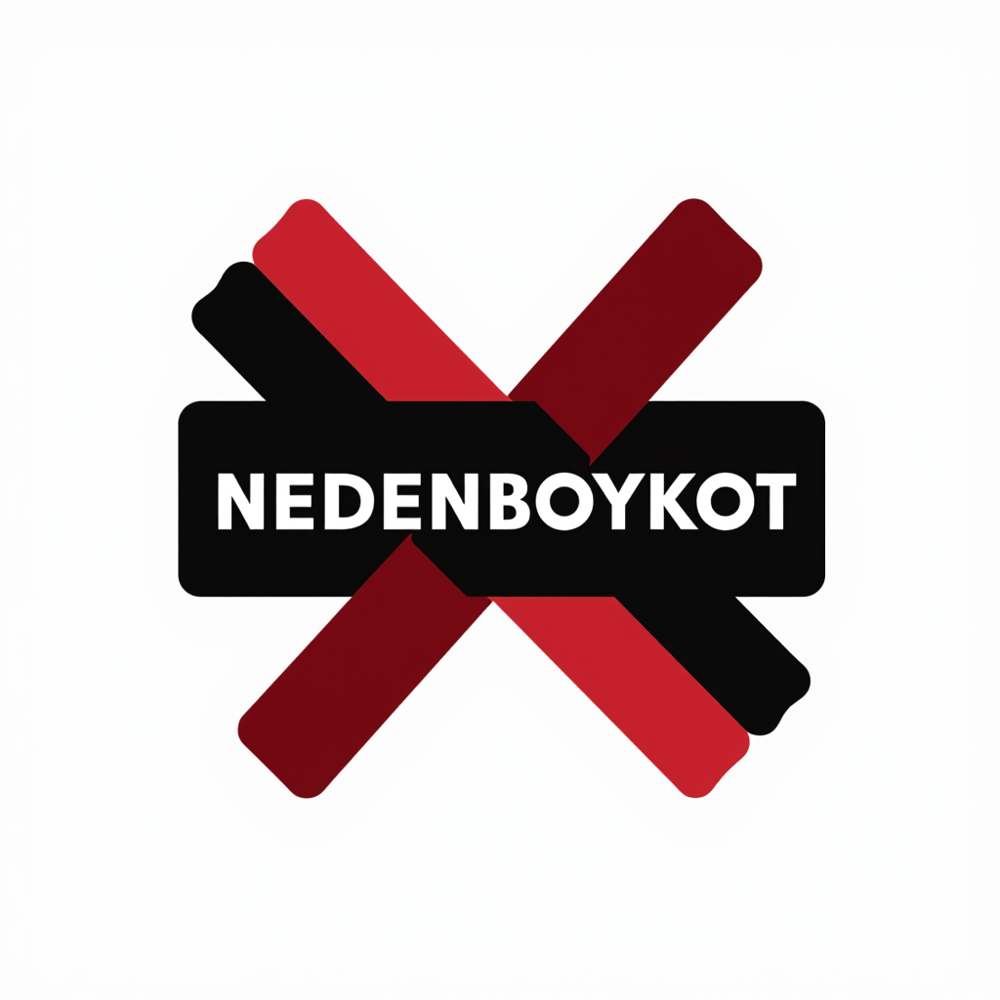

# NedenBoykot



Bu proje, boykot edilen şirketleri ve holdingleri bir zihin haritası formatında görselleştiren bir web uygulamasıdır. Kullanıcılar haritayı yakınlaştırıp kaydırarak inceleyebilir, şirketlere veya holdinglere tıklayarak ayrıntıları görebilir ve holdingler ile alt şirketler arasındaki bağlantıları inceleyebilir.

## Özellikler
- Zihin haritası formatında görselleştirme
- Yakınlaştırma ve kaydırma desteği
- Tıklanınca ayrıntı paneli
- JSON formatında veri yükleme
- Açık kaynak ve topluluk odaklı

## Kurulum
1. Bu depoyu klonlayın:
   ```bash
   git clone https://github.com/yurttasgirisimi/NedenBoykot.git
   ```
2. Bir web sunucusu kullanarak projeyi çalıştırın (örneğin, VS Code Live Server eklentisi ile).
3. `index.html` dosyasını tarayıcınızda açın.

## Veri Yapısı
Veriler `sirketler.json` dosyasında saklanır. JSON yapısı şu şekildedir:
- `dugumler`: Şirketler ve holdingler (kimlik, ad, tur, ayrintilar, kaynak)
- `baglantilar`: Holdingler ve alt şirketler arasındaki bağlantılar (kaynak, hedef)

Örnek bir JSON yapısı:
```json
{
  "dugumler": [
    { "kimlik": "anadolu_grubu", "ad": "Anadolu Grubu", "tur": "holding", "ayrintilar": "Turk hukumetine yakinligi nedeniyle boykot ediliyor.", "kaynak": "Keghart.org (2020)" },
    { "kimlik": "coca_cola", "ad": "Coca-Cola", "tur": "sirket", "ayrintilar": "Anadolu Grubu’na bagli, isci haklari ve cevresel sorunlar nedeniyle elestiriliyor.", "kaynak": "Ethical Consumer" }
  ],
  "baglantilar": [
    { "kaynak": "anadolu_grubu", "hedef": "coca_cola" }
  ]
}
```

## Kullanım
- Tarayıcınızı açın ve `index.html` dosyasını çalıştırın.
- Zihin haritasında şirketleri ve holdingleri görüntüleyin.
- Bir şirkete veya holdinge tıklayarak ayrıntıları sağ panelde görüntüleyin.
- Arama çubuğu ile şirket veya holding arayabilirsiniz.

## Katkıda Bulunma
- Yeni şirketler eklemek için `sirketler.json` dosyasını güncelleyin.
- Özellik önerileri veya hata düzeltmeleri için bir issue açın veya pull request gönderin.
- Kod veya veri yapısıyla ilgili değişiklikler yaparken, lütfen açıklayıcı commit mesajları kullanın.

## Lisans
Bu proje MIT Lisansı altında açık kaynak olarak paylaşılmıştır. Daha fazla bilgi için `LICENSE` dosyasına bakabilirsiniz.

## İletişim
Proje ile ilgili sorularınız veya önerileriniz için [yurttasgirisimi](https://github.com/yurttasgirisimi) ile iletişime geçebilirsiniz.
